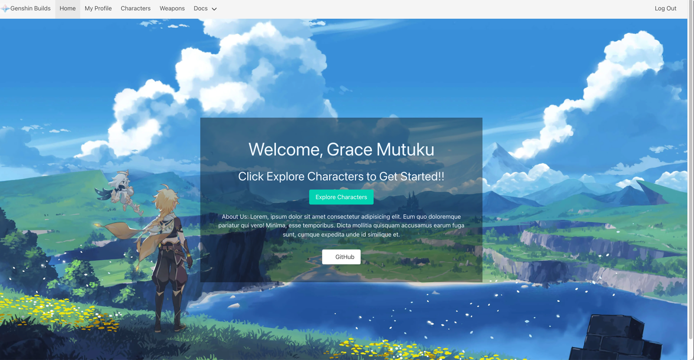
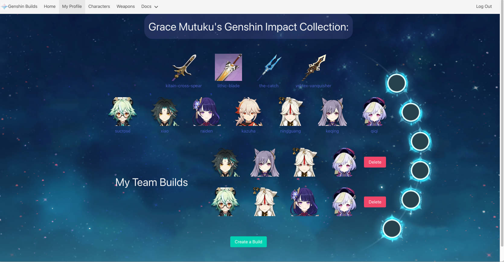
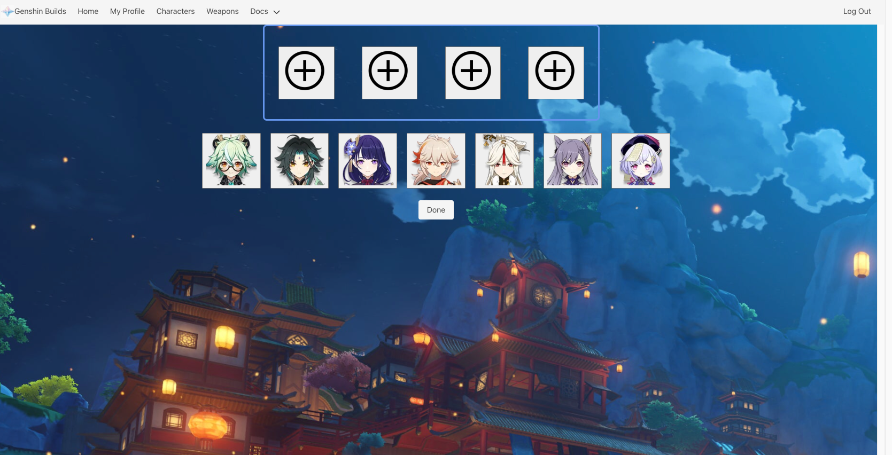
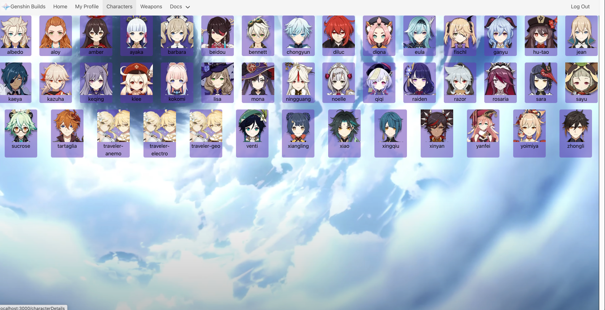

# Genshin Builds

Hello and welcome to Genshin Builds! An application where you, the user, can create your own hypothetical team builds in Genshin Impact.

## Getting started

[Click here to access Genshin Builds!](https://genshin-team-builder.herokuapp.com/)

[Trello](https://trello.com/c/pqwooGEy/8-erd)

- Below is the wireframe for the website: 

- Below is the ERD for the website: 

## User Stories
- AAU I want to be able to navigate to an "All Weapons" page so that I can view all weapons on a single page. 
- AAU I want to be able to sign up to the application so that I can log on to my own profile. 
- AAU I want to browse all characters so that I can add them to my collection. 
- AAU I want to be able to add, edit, and/or delete team builds from my profile. 
- AAU I want to collect characters/weapons so that I can create team builds in my profile. 

## Screenshots

- Below is a screenshot of the website upon logging in: 
   

- Below is a screenshot of the user's profile page: 
    

- Below is a screenshot of the "Create Build"page: 
    

- Below is a screenshot of the "Character Index" page: 
    

### Technologies used:

- JavaScript
- React
- dotenv
- CSS
- Bulma
- Flexbox
- HTML
- Git
- JSON Web Token
- Mongoose
- MongoDb
- React
- Express
- Node.js
- Axios
- Heroku

### Credits:

[Genshin.Dev](https://genshin.dev/) - Genshin Impact API

Genshin builds isn’t endorsed by miHoYo and doesn’t reflect the views or opinions of miHoYo or anyone officially involved in producing or managing Genshin Impact.
Genshin Impact and miHoYo are trademarks or registered trademarks of miHoYo. Genshin Impact © miHoYo.

### Stretch Goals:

- Add functionality to equip weapons to a user's characters 
- Add functionality to directly update builds 
- Add functionality to navigate to other user's profiles and view their builds and character/weapons collections 
- Add functionality to hide "Add to Collection" button for characters that are in the user's collection 
- Add functionality to add avatar to profile 