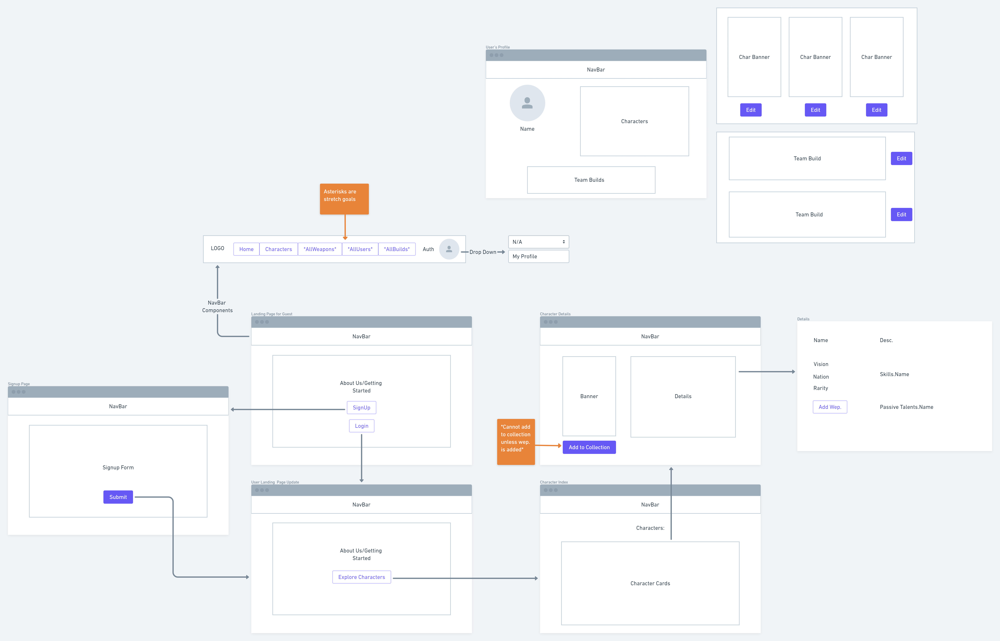
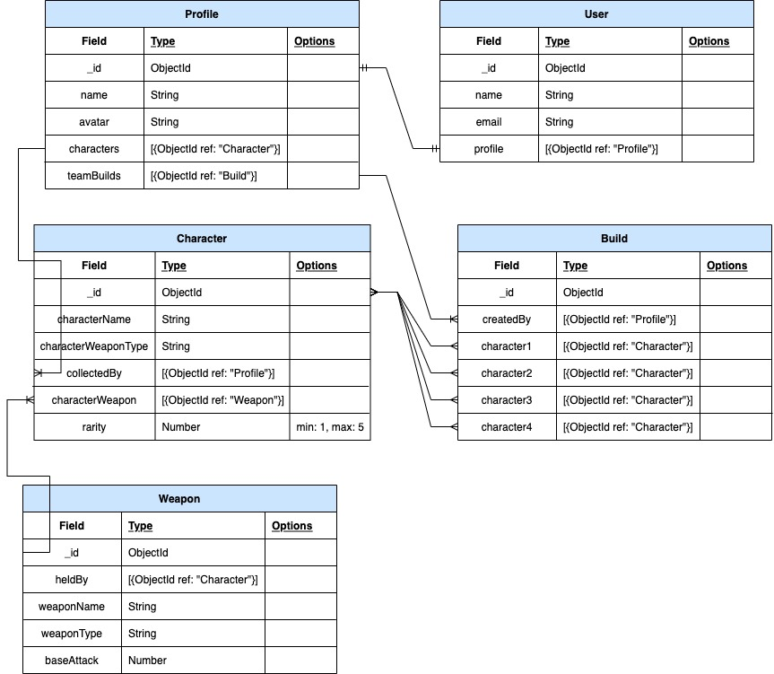

# Genshin Builds

Hello and welcome to Genshin Builds! An application where you, the user, can create your own hypothetical team build in Genshin Impact.

## Getting started

[Click here to get started](https://genshin-team-builder.herokuapp.com/)

[Trello](https://trello.com/c/pqwooGEy/8-erd)

Wireframe:

ERD:

Screenshots:
- (landing page screenshot coming soon)
- (profile page screenshot coming soon)
- (create a build screenshot page coming soon)
- (character page screenshot coming soon)

### Technologies used:

- JavaScript
- React
- dotenv
- CSS
- Bulma
- Flexbox
- HTML
- Git
- JSON Web Token
- Mongoose
- MongoDb
- React
- Express
- Node.js
- Axios
- Heroku

### Credits:

[Genshin.Dev](https://genshin.dev/) - Genshin Impact API

Genshin builds isn’t endorsed by miHoYo and doesn’t reflect the views or opinions of miHoYo or anyone officially involved in producing or managing Genshin Impact.
Genshin Impact and miHoYo are trademarks or registered trademarks of miHoYo. Genshin Impact © miHoYo.

### Stretch Goals:

- Adding artifacts to characters
- Navigate to other user's profiles and view their builds and collections